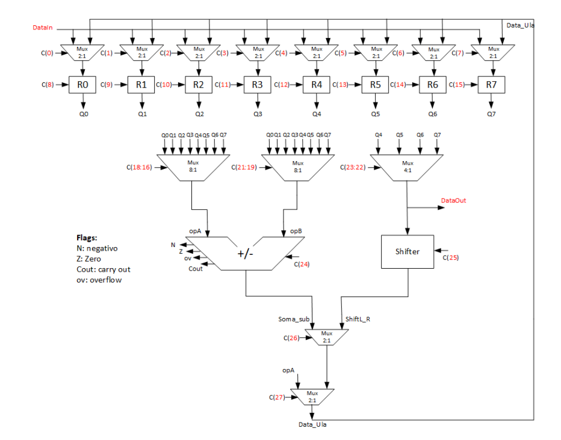
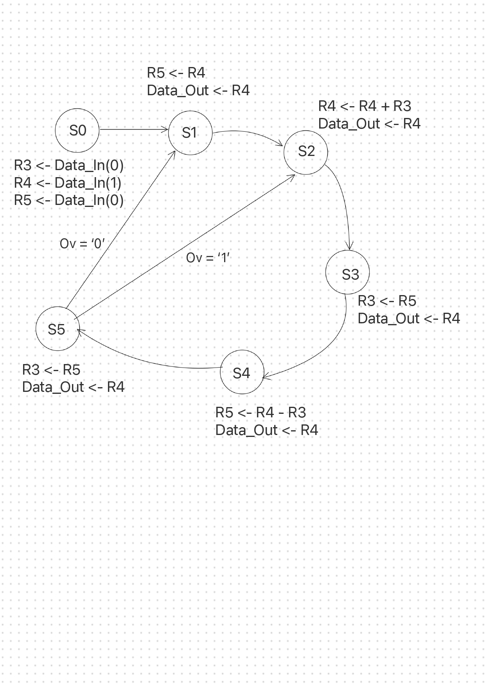

# Fibonacci with FMS

**Topic:** Using the Fibonacci sequence, calculate the largest possible value of the series that can be stored in an 8-bit register and display this value on the DataOut port.

>[!NOTE]
>Board: ***Altera DE2-70***

Our project settings, such as the pins on the board, are in the file **FLF.qpf**!

## Programmers
- [Lucas Lemes](https://github.com/L3mSv) 
- [Felipe H. Larangeira](https://github.com/FelipeHoffnLarangeira) 

## ***Datapath***

__Control block ***(datapath)***__: 
Consists of processing logic and a set of registers that perform the processing

## ***Control Unit***

__Operating block ***(Control Unit)***__: 
It is built with a logic that determines the
sequence in which data processing is performed in the operating block, through a finite state machine (FSM).

